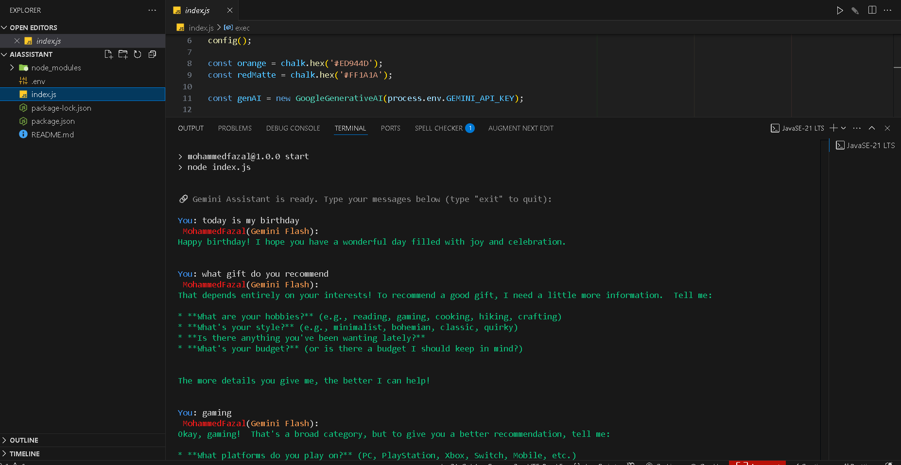

# AI Assitant

This project using  google ai studio plaform, gemini . You must be register [here](https://aistudio.google.com/) to get the `Secret Key`.

## Getting Started

- Open terminal.
- Run `npm install`. (I am using node v18) and npm install @google/generative-ai
- Copy the **secret key** from your ai studio account page. [here](https://aistudio.google.com/apikey)
- Run `cp .env`.
- Paste the **secret key** into the `.env` file.
- Run `npm start`.

## Preview Results

